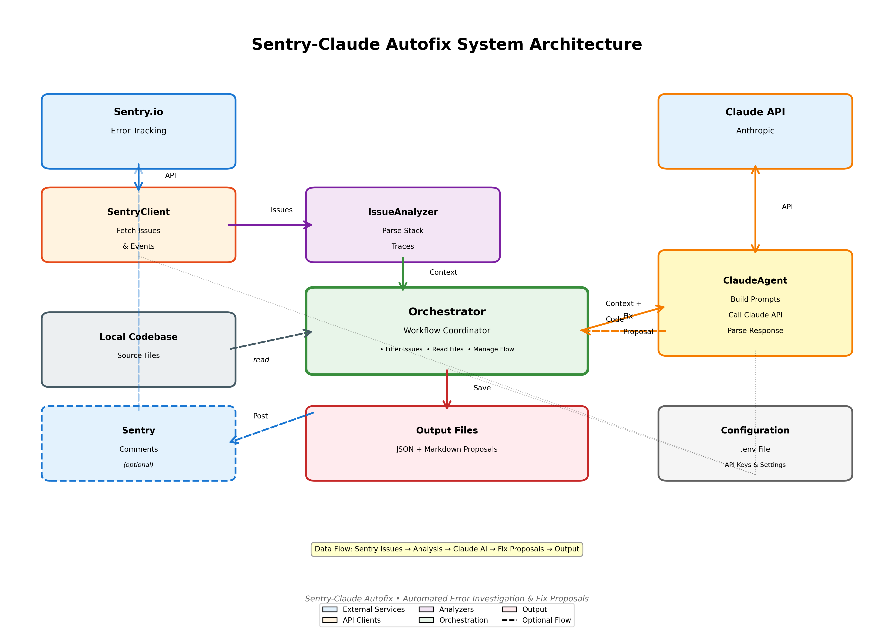

# Sentry-Claude Autofix

Automatically investigate and fix Sentry issues using Claude AI. This system fetches unresolved issues from your Sentry.io instance, analyzes them using Claude, and proposes fixes with detailed explanations.



## Features

- **Automatic Issue Fetching**: Retrieves unresolved issues from Sentry
- **Intelligent Analysis**: Uses Claude to analyze stack traces and error context
- **Fix Proposals**: Generates detailed fix proposals with code changes
- **Automatic PR Creation**: Creates branches, applies fixes, and opens draft PRs (⚠️ **Experimental** - see limitations below)
- **Sentry Integration**: Automatically comments on issues with analysis (optional)
- **Local Context**: Reads affected files from your codebase for better context
- **Confidence Scoring**: Provides confidence levels for proposed fixes
- **JSON & Markdown Output**: Saves proposals in both formats for easy review

## Prerequisites

- Node.js 18+ or higher
- A Sentry.io account with API access
- An Anthropic API key
- Access to the codebase that's being monitored by Sentry

## Installation

1. Clone this repository:
```bash
git clone <your-repo-url>
cd sentry-claude
```

2. Install dependencies:
```bash
npm install
```

3. Create a `.env` file based on `.env.example`:
```bash
cp .env.example .env
```

4. Configure your environment variables (see Configuration section below)

5. Find your project slug:
```bash
npm run list-projects
```

## Configuration

Edit the `.env` file with your credentials:

### Required Variables

- **SENTRY_AUTH_TOKEN**: Your Sentry authentication token
  - Generate at: https://monta-app.sentry.io/settings/account/api/auth-tokens/
  - Required scopes: `project:read`, `event:read`, `org:read`
  - Optional scope: `project:write` (only needed if `AUTO_COMMENT=true`)

- **SENTRY_ORG_SLUG**: Your Sentry organization slug (e.g., `monta-app`)

- **SENTRY_PROJECT_SLUG**: Your Sentry project slug
  - Run `npm run list-projects` to see all available projects

- **ANTHROPIC_API_KEY**: Your Anthropic API key
  - Get it at: https://console.anthropic.com/settings/keys

### Optional Variables

- **CODEBASE_PATH**: Path to your codebase (defaults to current directory)
- **MAX_ISSUES_PER_RUN**: Maximum issues to process per run (default: 5)
- **AUTO_COMMENT**: Whether to comment on Sentry issues (default: false)
  - Requires `project:write` scope on Sentry token
  - Set to `false` if you only want to save proposals locally
- **OUTPUT_DIR**: Directory for saving proposals (default: ./output)
- **AUTO_CREATE_PR**: Automatically create branches and draft PRs (default: false)
  - Requires codebase to be a git repository
  - Requires `gh` CLI to be installed and authenticated
  - Creates a new branch, applies fixes, commits, and opens a draft PR
- **BASE_BRANCH**: Base branch for PRs (default: main)

## Usage

### List Available Projects

Before running the autofix system, find your project slug:

```bash
npm run list-projects
```

This will display all projects in your Sentry organization with their slugs. Update your `.env` file with the correct `SENTRY_PROJECT_SLUG`.

### Test Connection

Verify your configuration:

```bash
npm run test:connection
```

### Run Once

Process issues once:

```bash
npm run dev
```

Or using the compiled version:

```bash
npm run build
npm start
```

### Enable Automatic PRs (⚠️ Experimental)

**⚠️ WARNING: This feature is experimental and disabled by default.**

**Current Limitations:**
- The code merging logic is simplistic and may replace entire files instead of making targeted changes
- **NOT RECOMMENDED for production use** without careful review
- Safe for testing only - always review generated PRs before merging

If you want to experiment with automatic PR creation:

1. **Git repository**: Your codebase must be a git repository
2. **GitHub CLI**: Install and authenticate `gh` CLI:
   ```bash
   brew install gh  # macOS
   gh auth login
   ```
3. **Enable in config**: Set `AUTO_CREATE_PR=true` in your `.env` file
4. **Test carefully**: Start with non-critical repositories

When enabled, the system will:
1. Create a new branch (`sentry-fix/ISSUE-ID-timestamp`)
2. Attempt to apply the proposed code fixes to your files
3. Commit the changes with a detailed message
4. Push the branch to GitHub
5. Create a draft pull request with full analysis

**Recommended workflow instead:**
- Keep `AUTO_CREATE_PR=false` (default)
- Review proposals in `output/` directory
- Manually apply fixes after review
- Create PRs manually with your own testing

### Scheduled Execution

To run automatically at intervals, you can use cron or a similar scheduler:

```bash
# Run every hour
0 * * * * cd /path/to/sentry-claude && npm start
```

Or use a process manager like PM2:

```bash
pm2 start npm --name "sentry-claude" -- start
pm2 save
```

## How It Works

1. **Fetch Issues**: Retrieves unresolved issues from Sentry API
2. **Filter**: Applies criteria to determine which issues should be auto-fixed
3. **Analyze**: Extracts stack traces, error messages, and affected files
4. **Gather Context**: Reads relevant files from your local codebase
5. **Investigate**: Sends context to Claude for analysis
6. **Propose Fix**: Claude generates a detailed fix proposal
7. **Save & Comment**: Saves proposal locally and comments on Sentry issue

## Output

For each processed issue, the system generates:

### JSON File (`{issue-id}_{timestamp}.json`)
Contains structured data including:
- Issue metadata
- Proposed changes
- Confidence level
- Timestamp

### Markdown File (`{issue-id}_{timestamp}.md`)
Human-readable format with:
- Issue summary
- Detailed analysis
- Code changes with descriptions
- Confidence assessment

Files are saved in the `output/` directory (or your configured `OUTPUT_DIR`).

## Example Output

```markdown
# Fix Proposal for PROJ-123

**Issue**: TypeError: Cannot read property 'name' of undefined
**Link**: https://monta-app.sentry.io/issues/123456789/
**Date**: 2024-01-15T10:30:00.000Z

## Analysis

The error occurs because the `user` object is undefined when the `getName`
function tries to access its `name` property. This happens when the API
returns a 404 for a user lookup, but the code doesn't handle the null case.

## Proposed Changes

### src/utils/user.ts

Add null checking before accessing user properties.

```typescript
export function getName(user: User | null): string {
  if (!user) {
    return 'Unknown User';
  }
  return user.name;
}
```

## Confidence

high - The stack trace clearly shows the issue, and the fix is straightforward.
```

## API Rate Limits

Be mindful of API rate limits:

- **Sentry**: Free tier allows 10,000 API requests per day
- **Anthropic**: Rate limits vary by plan

The system processes issues sequentially to avoid overwhelming the APIs.

## Limitations

### Issue Filtering

The system will skip issues that:
- Have no stack trace
- Have no in-app frames in the stack trace
- Have more than 10,000 occurrences (likely complex issues)
- Cannot be matched to files in the local codebase

### Automatic PR Creation (Experimental)

**⚠️ The auto-PR feature has significant limitations:**

1. **Code Merging**: The current implementation uses simplistic code merging logic that may:
   - Replace entire files instead of making targeted changes
   - Lose existing code and configuration
   - Introduce breaking changes

2. **Not Production-Ready**: This feature is experimental and should only be used:
   - In test/development environments
   - With thorough review of every generated PR
   - On non-critical codebases

3. **Recommended Approach**:
   - Keep `AUTO_CREATE_PR=false` (default setting)
   - Use the JSON/Markdown proposals for manual review
   - Apply fixes manually with proper testing
   - Create PRs through your normal workflow

The system excels at **analysis and proposal generation**, but automatic code modification needs more sophisticated diff/patch algorithms to be production-ready.

## Security

- Never commit your `.env` file
- Keep your API tokens secure
- Review all proposed fixes before applying them
- Use read-only Sentry tokens when possible

## Advanced Usage

### Custom Issue Filtering

Edit [src/issue-analyzer.ts:233](src/issue-analyzer.ts#L233) to customize which issues get auto-fixed:

```typescript
shouldAutoFix(context: IssueContext): boolean {
  // Add your custom logic here
  return true;
}
```

### Adjusting Claude's Analysis

Modify the prompt in [src/claude-agent.ts:22](src/claude-agent.ts#L22) to change how Claude analyzes issues.

### Adding More Context

Enhance `gatherCodebaseContext()` in [src/orchestrator.ts:124](src/orchestrator.ts#L124) to include additional files or context.

## Troubleshooting

### "Missing required environment variables"
Make sure all required variables in `.env` are set correctly.

### "Project does not exist" (404 error)
- Run `npm run list-projects` to see all available projects
- Verify your `SENTRY_PROJECT_SLUG` matches one from the list
- Check that you have access to the project
- Ensure `SENTRY_ORG_SLUG` is correct

### "Error fetching Sentry issues"
- Verify your `SENTRY_AUTH_TOKEN` is correct and has proper scopes
- Check that `SENTRY_ORG_SLUG` and `SENTRY_PROJECT_SLUG` are correct
- Run `npm run list-projects` to verify available projects
- Ensure your Sentry plan allows API access

### "Could not locate this file in the codebase"
- Verify `CODEBASE_PATH` points to the correct directory
- Check that file paths in Sentry match your local structure
- Ensure source maps are properly configured in Sentry

### Claude API errors
- Verify your `ANTHROPIC_API_KEY` is valid
- Check your API rate limits and quotas
- Ensure you have sufficient credits

## Development

### Build
```bash
npm run build
```

### Watch Mode
```bash
npm run watch
```

### Run Development Mode
```bash
npm run dev
```

## Architecture

For detailed technical architecture, see [ARCHITECTURE.md](ARCHITECTURE.md).

For AI assistant context, see [CLAUDE.md](CLAUDE.md).

```
┌─────────────┐
│   Sentry    │
│     API     │
└──────┬──────┘
       │
       ▼
┌─────────────────┐      ┌─────────────────┐
│ Sentry Client   │─────▶│ Issue Analyzer  │
└─────────────────┘      └────────┬────────┘
                                  │
                                  ▼
                         ┌─────────────────┐
                         │  Orchestrator   │
                         └────────┬────────┘
                                  │
                                  ▼
                         ┌─────────────────┐
                         │  Claude Agent   │
                         └────────┬────────┘
                                  │
                                  ▼
                         ┌─────────────────┐
                         │ Fix Proposals   │
                         │  (JSON + MD)    │
                         └─────────────────┘
```

## Contributing

Contributions are welcome! Please:
1. Fork the repository
2. Create a feature branch
3. Make your changes
4. Submit a pull request

## License

MIT License - see LICENSE file for details

## Support

For issues or questions:
- Check the Troubleshooting section
- Review Sentry API docs: https://docs.sentry.io/api/
- Review Anthropic API docs: https://docs.anthropic.com/

## Roadmap

Future enhancements:
- [ ] Automatic PR creation with proposed fixes
- [ ] Support for multiple projects
- [ ] Web dashboard for reviewing proposals
- [ ] Integration with GitHub Actions
- [ ] Support for other error tracking services
- [ ] Machine learning-based issue prioritization
- [ ] Automated testing of proposed fixes
